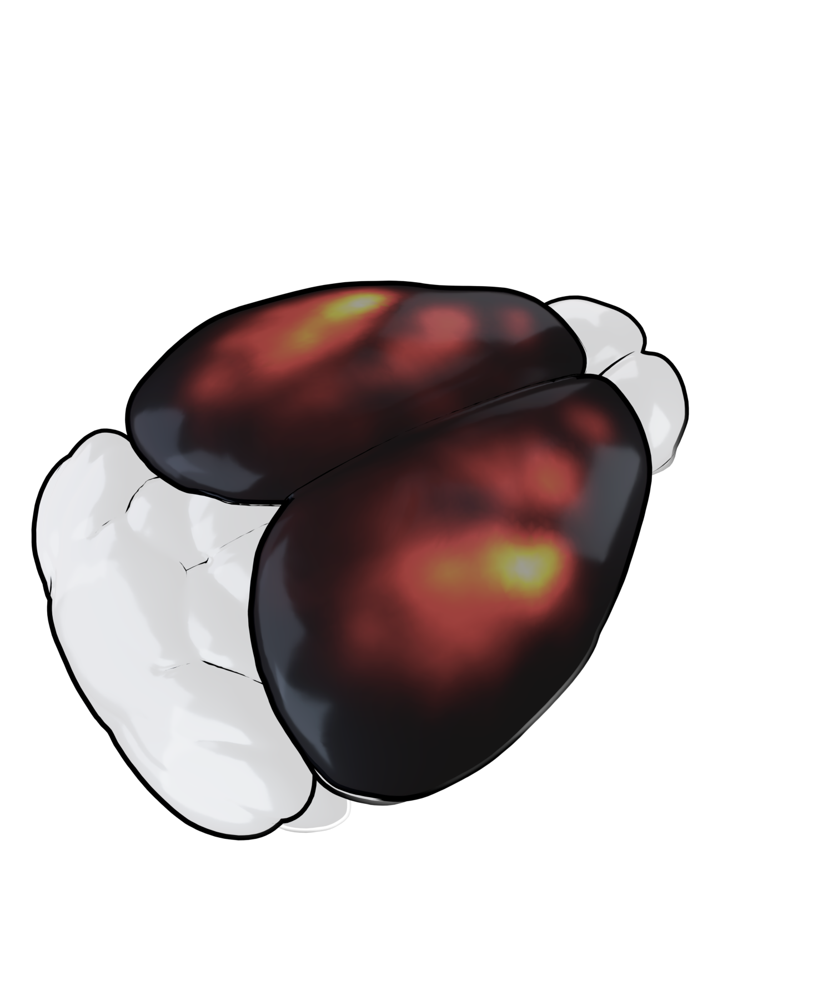

# Rotating Wave Phase Map on a 3D Mouse Brain

Render a 2D dorsal cortical phase map onto a 3D Allen CCF mouse brain in Blender.

| Phase map | Spiral density map |
|:---------:|:-----------------:|
|  |  |

---

## How it works

The phase map and the brain mesh share the same coordinate space — the **Allen Common Coordinate Framework (CCF)**. This makes the overlay straightforward:

1. **The brain mesh** (`isocortex.obj`) is a 3D surface where every vertex has a position in CCF micrometres (AP, DV, ML axes).
2. **The phase map** (`phase_colormap.npy`) is a 2D top-down image of the dorsal cortex, where rows = AP axis and columns = ML axis, also in CCF space.
3. **The overlay** is a bilinear lookup: for each 3D vertex, read its (AP, ML) coordinate and sample the corresponding pixel color from the phase image. No registration or warping is needed because both datasets are already aligned to CCF.

```
phase_colormap.npy               isocortex.obj
(2D image, AP × ML)              (3D mesh, vertices in CCF µm)
        │                                 │
        └──────── for each vertex: ───────┘
                  look up color at (AP, ML)
                  via bilinear interpolation
                        │
                        ▼
                vertex_colors.npy
                (one RGBA color per vertex)
                        │
                        ▼
                  Blender render
```

---

## Installation

```bash
git clone https://github.com/zhiwen10/rotating-wave-brain-render.git
cd rotating-wave-brain-render
conda env create -f environment.yml
conda activate brain_render_2d
```

Or with pip: `pip install -r requirements.txt`

> **Blender** (3.x or 4.x) is needed for Step 3 only — install it separately from [blender.org](https://www.blender.org/download/). The Python packages above are **not** needed inside Blender.

---

## Workflow

```
Step 0 (MATLAB)           Step 1                    Step 2                        Step 3
──────────────────────    ──────────────────────    ─────────────────────────     ──────────────────────────
00_phase_to_rgba.m        01_export_brain_meshes.py  02_phasemap_to_vertex_colors  03_render_blender.py
                                                     .py (or Jupyter notebook)
runs on: MATLAB            runs on: Python            runs on: Python               runs on: Blender
                                                                                              │
input:   phase data        Allen CCF atlas            raw_data/                     raw_data/
         cortex mask       (auto-download)             phase_colormap.mat            root.obj
                                                       isocortex.obj                isocortex.obj
                                                                                   processed_data/
                                                                                    vertex_colors.npy
output:  raw_data/         raw_data/                  processed_data/               processed_data/
          phase_colormap    root.obj                   vertex_colors.npy             render_metallic.png
          .mat              isocortex.obj
```

---

## Steps

### Step 0 — Export phase map from MATLAB

Run `scripts/00_phase_to_rgba.m` in MATLAB to convert a phase frame to a cyclic-colormap RGB image and add a cortex mask alpha channel. Saves `raw_data/phase_colormap.mat` containing `rgbaImage` (H × W × 4: RGB + alpha mask).

---

### Step 1 — Export brain meshes

> Skip this step if you are using the provided `raw_data/` files.

Run `scripts/01_export_brain_meshes.py` in the `brain_render_2d` conda env.

```bash
python scripts/01_export_brain_meshes.py
```

Downloads the Allen CCF 25 µm atlas via `brainglobe-atlasapi` (first run only,
~hundreds of MB) and exports `root.obj` and `isocortex.obj` into `raw_data/`.

---

### Step 2 — Prepare vertex colors

Run `scripts/02_phasemap_to_vertex_colors.py`:

```bash
python scripts/02_phasemap_to_vertex_colors.py
```

Loads `raw_data/phase_colormap.mat` (from Step 0), interpolates the RGBA phase colors onto the mesh vertices using the cortex mask alpha, and saves `processed_data/vertex_colors.npy`.

> To render a spiral density map instead, replace `vertex_colors.npy` with `vertex_colors_density.npy` generated by `scripts/02b_density_to_vertex_colors.py`.

---

### Step 3 — Render in Blender

1. Open Blender → **Scripting** tab
2. Open a render script, set `raw_data_dir` and `processed_data_dir` at the top
3. Press **▶ Run Script** (or **Alt+P**)

Run `scripts/03_render_blender.py` — reads `processed_data/vertex_colors.npy` and saves `processed_data/render_metallic.png`.

---

## Data folders

### `raw_data/` — inputs (provided in this repo)

| File | Description |
|------|-------------|
| `phase_colormap.mat` | RGBA phase map, shape `(1320, 1140, 4)`: RGB + cortex mask alpha, registered to Allen CCF. Generated by `00_phase_to_rgba.m`. |
| `spiral_density.mat` | Spiral event coordinates and density, columns: `[ML_voxel, AP_voxel, density]` |
| `isocortex.obj` | Dorsal isocortex surface mesh |
| `root.obj` | Whole-brain outer shell |

### `processed_data/` — outputs (generated by Steps 2–3)

| File | Generated by | Description |
|------|-------------|-------------|
| `vertex_colors.npy` | Step 2 notebook | Per-vertex RGBA phase colors |
| `vertex_colors_density.npy` | `02b_density_to_vertex_colors.py` | Per-vertex RGBA density colors |
| `render_metallic.png` | `03_render_blender.py` | 3D render — phase map, metallic style |
| `render_density.png` | `03b_render_density.py` | 3D render — density map, metallic style |

---

## Changing the camera angle

Each render script has a hardcoded camera angle near the bottom. To capture a
new one:

1. Navigate to the desired view in the Blender 3D viewport
2. Run `scripts/extract_camera_params.py` with `MODE = 'viewport'`
3. Paste the printed `cam_obj.location` and `cam_obj.rotation_euler` into the render script

> Set `raw_data_dir` and `processed_data_dir` at the top of each render script before running.

> On macOS, launch Blender from Terminal to see printed output:
> `/Applications/Blender.app/Contents/MacOS/Blender`
